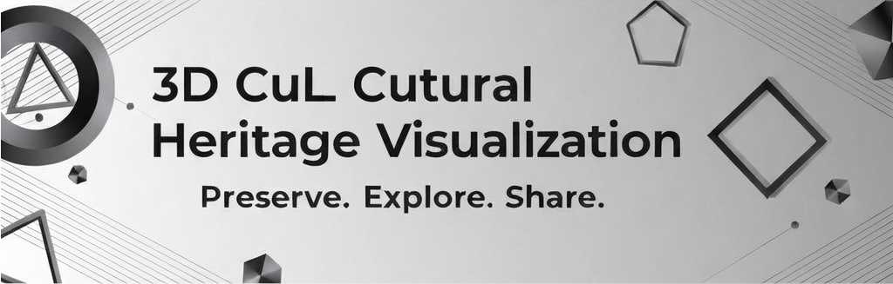
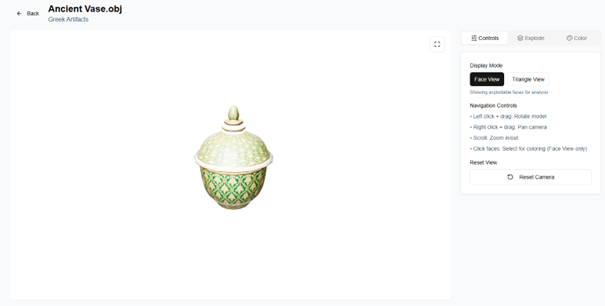
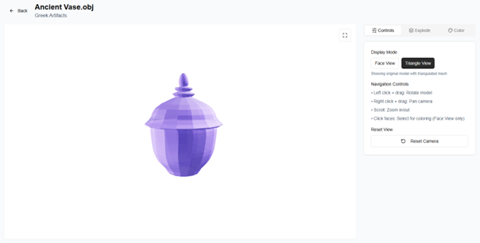
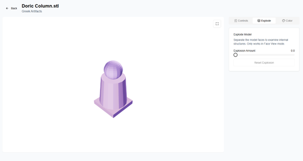
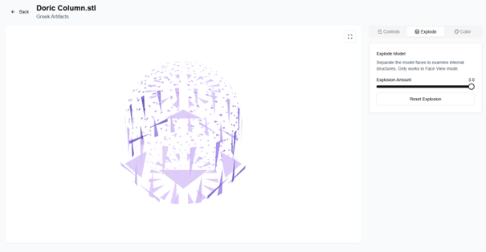
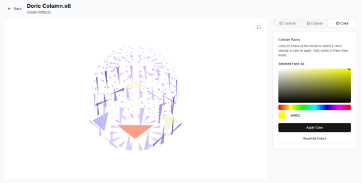

<div align="center">



# 3D Cultural Heritage Data Visualization

</div>

<div align="center">


**An innovative web-based platform for digitizing, managing, and interactively visualizing 3D models of cultural artifacts.**

A comprehensive solution enabling researchers, curators, and students to upload, organize, and explore 3D cultural heritage artifacts through advanced WebGL-based visualization with real-time interaction capabilities.

[Features](#features) ✦ [Use Cases](#use-cases) ✦ [Installation](#installation) ✦ [Architecture](#architecture) ✦ [Contributing](#contributing) ✦ [License](#license)

</div>

---

## 🌟 Features

### Core Functionality

- **Multi-Format 3D Support**: Import OBJ, PLY, STL, GLB, and GLTF files seamlessly
- **Interactive 3D Viewer**: Smooth rotate, pan, zoom controls with GPU-accelerated WebGL rendering at 60 FPS
- **Face-Level Analysis**: Select and color individual mesh faces for detailed artifact examination
- **Exploded View**: Separate mesh faces from center point for comprehensive structural analysis
- **Automatic Model Normalization**: Intelligent centering and scaling for consistent visualization

### Management System

- **Secure Authentication**: JWT token-based auth with bcrypt password hashing (12-round cost factor)
- **Role-Based Access Control**: Admin, Researcher, Curator, and Student roles with granular permissions
- **Folder Organization**: Create and manage collections with hierarchical folder structures
- **Gallery Browser**: Discover and view artifacts uploaded by the research community
- **User Data Isolation**: Complete data privacy with user-specific access controls

### Technical Excellence

- **Responsive Design**: Mobile-first approach supporting all devices and screen sizes
- **Dark/Light Theme**: Toggle between visual themes for optimal viewing experience
- **Real-Time Search**: Filter models and folders with instantaneous results
- **Activity Logging**: Comprehensive audit trails for security and accountability
- **File Upload Validation**: Client and server-side validation with 100MB size limit per file

---

## 🎯 Use Cases

| Use Case | Description | Benefit |
|----------|-------------|---------|
| **Museum Virtual Exhibitions** | Create online exhibits accessible worldwide without physical constraints | Global audience access to irreplaceable artifacts |
| **Archaeological Documentation** | Record excavation findings in 3D for permanent digital preservation | Site documentation survives physical deterioration |
| **Academic Research** | Compare artifacts across institutions for collaborative scholarship | Researchers collaborate globally without travel |
| **Educational Programs** | Provide interactive learning materials for students to examine artifacts virtually | Hands-on learning without physical handling risks |
| **Conservation Planning** | Document artifact condition before/after restoration procedures | Track restoration progress and preservation efforts |
| **Cultural Heritage Preservation** | Safeguard endangered cultural artifacts through digital scanning | Digital backup against loss or damage |

---

## 🛠️ Technology Stack

### Frontend
| Technology | Version | Purpose |
|------------|---------|---------|
| **Next.js** | 15 | React framework with SSR and optimization |
| **React** | 19 | UI library with hooks and server components |
| **TypeScript** | Latest | Type-safe development and early error detection |
| **Three.js** | 0.171.0 | WebGL 3D graphics rendering |
| **Tailwind CSS** | v4 | Utility-first CSS framework |
| **shadcn/ui** | Latest | Accessible component library |

### Backend
| Technology | Version | Purpose |
|------------|---------|---------|
| **Flask** | 3.1 | Python web framework |
| **PyJWT** | 2.10.1 | JWT authentication tokens |
| **bcrypt** | 4.2.1 | Secure password hashing |
| **mysql-connector-python** | 9.1.0 | MySQL database driver |

### Database
| Technology | Version | Purpose |
|------------|---------|---------|
| **MySQL** | 8.x | Relational database with ACID compliance |
| **InnoDB** | Built-in | ACID-compliant storage engine |

### Deployment Ready
- **Vercel**: Frontend deployment with automatic optimization
- **AWS/DigitalOcean**: Backend hosting with scalability
- **AWS S3**: Object storage for 3D models (production)
- **AWS RDS**: Managed database with automated backups

---

## 📋 Prerequisites

Before installation, ensure you have:

| Requirement | Version | Purpose |
|-------------|---------|---------|
| **Node.js** | 18.x+ | JavaScript runtime for frontend |
| **npm/yarn** | Latest | Package manager |
| **Python** | 3.8+ | Backend runtime |
| **MySQL** | 8.x | Database server |
| **Git** | Latest | Version control |

### Optional (for production)
- AWS Account (for S3 and RDS)
- Vercel Account (for frontend deployment)
- SSL Certificate (for HTTPS)

---

## 🚀 Installation

### 1. Clone the Repository

```bash
git clone https://github.com/Saladdua/cultural-heritage.git
cd cultural-heritage
```

### 2. Frontend Setup

```bash
# Install dependencies
npm install

# Create environment file
cat > .env.local << EOF
NEXT_PUBLIC_API_URL=http://localhost:5000
NEXT_PUBLIC_DEV_SUPABASE_REDIRECT_URL=http://localhost:3000
EOF

# Start development server
npm run dev
# Frontend available at http://localhost:3000
```

### 3. Backend Setup

```bash
cd backend

# Create Python virtual environment
python -m venv venv
source venv/bin/activate  # On Windows: venv\Scripts\activate

# Install dependencies
pip install -r requirements.txt

# Create environment file
cat > .env << EOF
FLASK_ENV=development
DATABASE_URL=localhost
DATABASE_USER=root
DATABASE_PASSWORD=your_password
DATABASE_NAME=heritage_db
SECRET_KEY=$(openssl rand -hex 32)
JWT_SECRET=$(openssl rand -hex 32)
EOF

# Run Flask server
python app.py
# Backend API available at http://localhost:5000
```

### 4. Database Setup

```bash
# Connect to MySQL
mysql -u root -p

# Execute in MySQL
CREATE DATABASE heritage_db;
EXIT;

# Load schema
mysql -u root -p heritage_db < schema.sql
```

### 5. Verify Installation

```bash
# Test API endpoint
curl http://localhost:5000/api/health

# Test frontend
open http://localhost:3000
```

---

## 📖 Quick Start Guide

### 1. User Registration
```bash
# Sign up with your credentials
POST /api/auth/register
{
  "username": "researcher1",
  "email": "researcher@example.com",
  "password": "securePassword123",
  "first_name": "John",
  "last_name": "Doe",
  "organization": "University of Oxford"
}
```

### 2. Create Collection Folder
- Navigate to Dashboard → Folder Management
- Click "Create Folder"
- Name your collection (e.g., "Ancient Pottery")
- Add descriptive information

### 3. Upload 3D Model
- Select your folder
- Click "Upload Model"
- Choose file (OBJ, PLY, STL, GLB, GLTF)
- File auto-centers and loads in viewer
- Maximum file size: 100MB

### 4. Explore & Analyze



- **Rotate**: Left-click and drag
- **Pan**: Right-click and drag
- **Zoom**: Scroll wheel





- **Color Faces**: Click "Face Coloring" tool
- **Explode View**: Drag "Explosion" slider (0-5)
- **Reset View**: Click "Reset Camera"

### 5. Share Discoveries
- Browse Gallery to see community models
- Access public models from other researchers
- View uploader information and organization

---

## 🏗️ Architecture Overview

```
┌─────────────────────────────────────────────────────────┐
│                     User Browser                         │
├─────────────────────────────────────────────────────────┤
│   Next.js Frontend (Port 3000)                          │
│   • Authentication & Dashboard                          │
│   • 3D Viewer with WebGL Canvas                         │
│   • Folder & Gallery Management                         │
└────────────────┬────────────────────────────────────────┘
                 │ RESTful API (JSON)
┌────────────────▼────────────────────────────────────────┐
│   Flask Backend (Port 5000)                             │
│   • JWT Authentication & Authorization                  │
│   • Model Upload & Validation                           │
│   • 3D Format Parsing                                   │
│   • File Storage Management                             │
└────────────────┬────────────────────────────────────────┘
                 │
    ┌────────────┴──────────────┐
    │                           │
┌───▼──────┐          ┌─────────▼────────┐
│ MySQL DB │          │ File Storage     │
│ (3306)   │          │ (uploads folder) │
├──────────┤          ├──────────────────┤
│ • Users  │          │ 3D Model Files   │
│ • Folders│          │ User-Organized   │
│ • Models │          │ UUID Filenames   │
└──────────┘          └──────────────────┘

3D Rendering Pipeline:
File → Three.js Loader → Geometry Processing → WebGL Canvas
       (OBJ/PLY/STL)    (Center, Scale)      (60 FPS)
```

### Key Components

**Frontend Components** (20+)
- Authentication pages (Login, Register)
- Dashboard with navigation
- Folder management interface
- 3D viewer with interactive controls
- Gallery browser with search
- User profile management

**Backend Services** (15+ API endpoints)
- Authentication service (register, login, logout)
- User management
- Folder CRUD operations
- Model upload and management
- Gallery listing and filtering
- 3D file processing

**Database Schema**
- `users`: Authentication and profile data
- `folders`: Collection organization
- `models`: 3D model metadata
- `user_activity`: Audit logging

---

## 🔐 Security Features

### Authentication & Authorization
- ✓ JWT tokens with 24-hour expiration
- ✓ bcrypt password hashing (12-round cost factor)
- ✓ Role-Based Access Control (RBAC)
- ✓ User data isolation per user

### Data Protection
- ✓ Parameterized SQL queries (prevent injection)
- ✓ Input validation (client & server)
- ✓ File type whitelisting
- ✓ Secure filename handling
- ✓ CORS protection with origin validation

### File Security
- ✓ File type verification (magic numbers)
- ✓ Size limit enforcement (100MB max)
- ✓ User-specific storage directories
- ✓ No execution permissions on upload folder

### Audit & Logging
- ✓ Activity logging for all operations
- ✓ Failed login attempt tracking
- ✓ Change history for data modifications
- ✓ IP address and user-agent logging

---

## 📊 Performance Metrics

| Metric | Target | Status |
|--------|--------|--------|
| First Contentful Paint | < 1.5s | Achieved |
| Time to Interactive | < 3s | Achieved |
| Model Load Time (5MB avg) | < 2s | Achieved |
| 3D Rendering Performance | 60 FPS | Achieved (< 100k faces) |
| Concurrent Users (single instance) | 100-500 | Scalable |

### Optimization Techniques
- Code splitting by route
- Image optimization
- Database query optimization
- Three.js rendering optimization
- Gzip compression
- Browser caching with ETags

---

## 🧪 Testing

### Frontend Tests
```bash
npm run test
npm run lint
npm run type-check
```

### Backend Tests
```bash
cd backend
pytest
flake8 .
mypy .
```

---

## 📚 Documentation

- [Architecture Guide](./ARCHITECTURE.md) - Detailed system design
- [API Documentation](./API_DOCUMENTATION.md) - Complete endpoint reference
- [Deployment Guide](./DEPLOYMENT.md) - Production setup instructions
- [Contributing Guide](./CONTRIBUTING.md) - Development guidelines

---

## 🤝 Contributing

We welcome contributions from developers, researchers, and cultural heritage professionals!

### Getting Started
1. Fork the repository
2. Create feature branch: `git checkout -b feature/amazing-feature`
3. Commit changes: `git commit -m 'Add amazing feature'`
4. Push to branch: `git push origin feature/amazing-feature`
5. Open Pull Request

### Development Guidelines
- Follow existing code style
- Add tests for new features
- Update documentation
- Ensure TypeScript compilation
- Test on multiple browsers

See [CONTRIBUTING.md](./CONTRIBUTING.md) for detailed guidelines.

---

## 📄 License

This project is licensed under the **MIT License** - see [LICENSE](./LICENSE) file for details.

### What this means:
- ✓ Free to use commercially
- ✓ Modify and distribute
- ✓ Private and public use
- ✗ No liability or warranty


</div>
